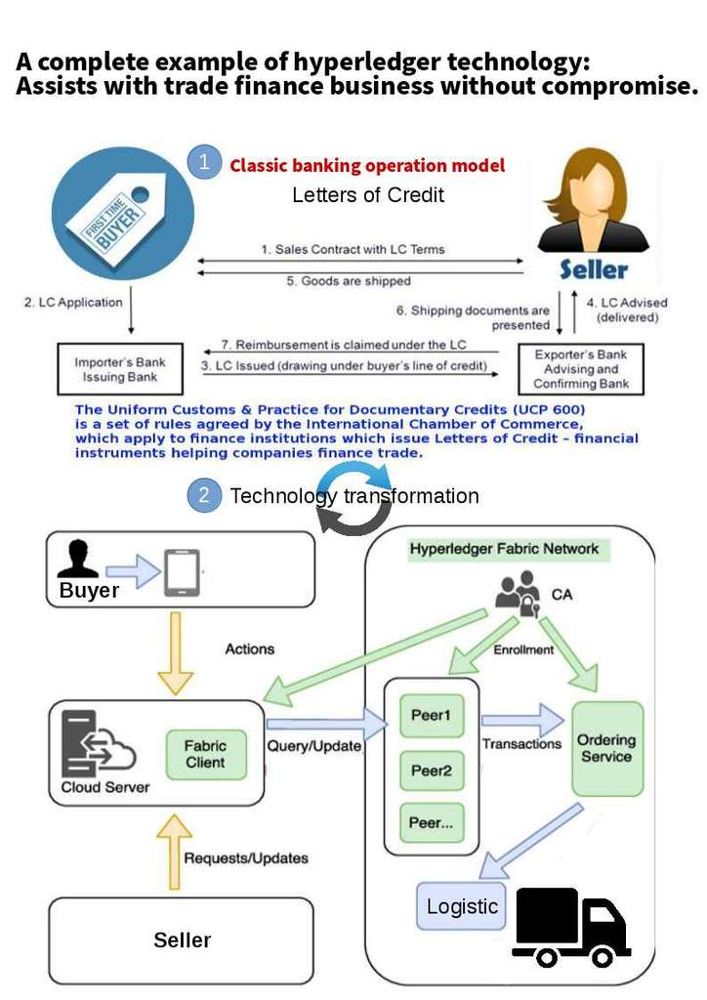

# HyperledgerDemo
 [Application Leter of Credit](http://52.23.161.130:8080/)
 
 [Visit Wiki page to see more details](https://github.com/reapra-hbaocr/HyperledgerDemo/wiki)
 
 [Project Src code](https://drive.google.com/file/d/1_0dzbK1yBAxW8adxHk5jsdnV4ZccTYx3/view?usp=sharing)
 
 * The guide to setup the Hyperledger Fabric Blockchain (backend) Step by step
 * The demo documentation
 * ...
 
 ## Workflow of Letter of Credit Application
 
 
 

## Install

*  Setup Hyperledger platform
[Setup hyperledger platform](https://github.com/reapra-hbaocr/HyperledgerDemo/wiki/1.-Setup-Hyperledger-Fabric-step-by-step)

* Clone Project or download zip from  [Project Src code](https://drive.google.com/file/d/1_0dzbK1yBAxW8adxHk5jsdnV4ZccTYx3/view?usp=sharing)
```Sh
#Clone src code
git clone https://github.com/reapra-hbaocr/HyperledgerDemo.git 
```

* Deploy Project

```Sh
cd hyperledgerFabricLoC/
cd packages/letters-of-credit/
./installer/install.sh
```
 
